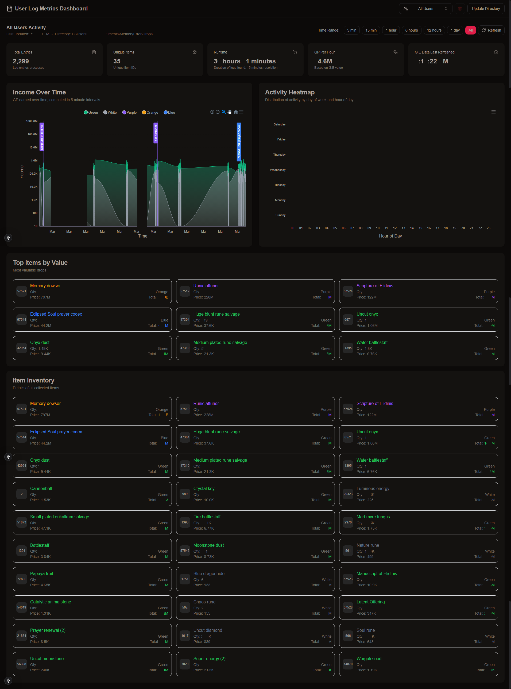

# METrics

This is a Data Visualization project for MemoryError Drop Logs that's built using React and Next.js.

- Uses a SQLite database to store Item information and configuration
- Automatically updates G.E pricing information when Runescape updates it
- Supports metrics computation for all users or specific users
- Supports clearing the logfile from the UI
- Auto-refreshes every 5 minutes


> To push data from ME so it is accessible here, you need to call the below method
>   ```lua
>       API.LogDrop(item.id, item.quantity)
>   ```

<details>
<summary>Example VIew</summary>



</details>

---

## Configuration

Copy [env.example](https://github.com/deadcodes/METrics/blob/master/env.example) over to a new file '.env' and fill in the database name.

> [!IMPORTANT]
> When it asks for a `Log Directory` path, provide the path to the `Drops` folder  in `MemoryError` in `Documents`
> `C:\Users\YOUR_WINDOWS_ACCOUNT_NAME_HERE\Documents\MemoryError\Drops`

---

## Running locally in development mode

To get started, just clone the repository and run `npm install && npm run dev`:

    git clone https://github.com/deadcodes/METrics.git
    npm install
    npm run db:init
    npm run dev

---

## Upkeep

- You have to update the `items.json` when the game updates (new items are added to the game)
    <details>
    <summary>Steps to update</summary>

    - Download the `items` file from [here](https://chisel.weirdgloop.org/gazproj/cache)
    - Upload it into this [Json Editor](https://jsoneditoronline.org/)
    - Click on `Transform`
    - Click on the Settings icon in the top right and select **JavaScript**
    - Paste the below function in the `Query`
        ```javascript
        function query(data) {
            return _.chain(data)
                .orderBy(['id'], ['asc'])
                .map(item => ({
                    "id": item?.id,
                    "name": item?.name,
                    "tradeable": item?.notTradeable || false,
                    "isOnGE": item?.is_on_ge || false,
                    "value": item?.value || 0,
                    "alch": item?.value ? item.value * 0.6 : 0,
                    "stackable": item?.stackableAlways || false,
                }))
                .value()
        }
        ```
    - Click **Transform** in the bottom right of the modal
    - Click on the **Compact Json** button on the right pane
    - Copy the editor contents in the right window and update the `items.json`
    </details>

- Managing the logfiles is upto you. When data becomes too much, the application may slowdown

---

## Building and deploying in production

If you wanted to run this site in production, you should install modules then build the site with `npm run build` and run it with `npm start`:

    npm install
    npm run db:init
    npm run build
    npm start

You should run `npm run build` again any time you make changes to the site.

Note: If you are already running a webserver on port 80 (e.g. Macs usually have the Apache webserver running on port 80) you can still start the example in production mode and a different available port is picked.

---

## TODO

* [ ] Method to generate `items.json` providing an input url
* [ ] Have page refresh initiated from the server side when logfile updates
* [ ] More accurate calculation of GP/hr across long durations
* [ ] Memoization to reduce method calls
